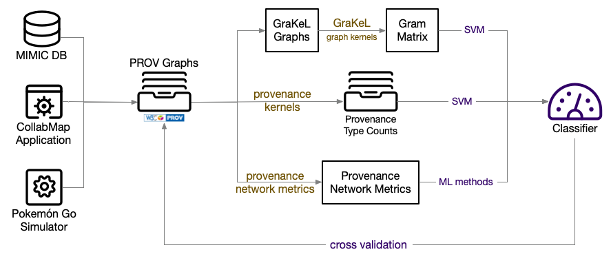

# Provenance Kernel Evaluation

This repository provides the source code and the datasets used in our evaluation of provenance kernels.



## Results

The results are reported in our paper: [Provenance Graph Kernels](https://arxiv.org/abs/2010.10343).

## Setting up and running the pipeline

The setting up and running of the evaluation pipeline is automated by the provided [`Makefile`](Makefile) script. Run the following command in the repository root folder to execute the script:

```bash
make plots
```

## Datasets

### MIMIC-III

[MIMIC-III](https://mimic.physionet.org) is an openly available dataset comprising de-identified health data associated with over 53,000 intensive care unit admissions at a hospital in the United States. It contains details collected from hospital stays of over 30,000 patients, including their vital signs and medical measurements, the procedures done on them and by whom, their diagnostics, etc. In this application, we use the data from MIMIC-III to reconstruct a patient's journey through the hospital in a provenance graph.

The code to generate a provenance graph from a patient admission in the MIMIC dataset is provided in the folder [`scripts/mimic`](scripts/mimic). However, the code will need access to the MIMIC PostgreSQL database. To gain access to the data, please follow the [instructions here](https://mimic.physionet.org/gettingstarted/access/). Once a MIMIC database is accessible, update the environment variable `MIMIC_DB_URI` in the file [`.env`](.env) to the correct database URI.

To exclude the experiments on the MIMIC dataset, remove `MIMIC-PXC7` from the list of datasets to be processed defined in the `DATASETS` variable of the [`Makefile`](Makefile#L6).

### CollabMap

[CollabMap](https://dl.acm.org/doi/10.1145/2464464.2464508) is a crowdsourcing platform for constructing evacuation maps for urban areas. In these maps, evacuation routes connect exit of buildings to the nearby road network. Such routes need to avoid obstacles that are not explicit in existing maps (e.g. walls or fences). The application crowdsources the drawing of such evacuation routes from the public by providing them aerial imagery and ground-level panoramic views of an interested area. It allows non-experts to perform tasks without them needing expertise other than drawing lines on an image. The task of identifying all evacuation routes for a building was broken into micro-tasks performed by different contributors: building identification (outline a *building*), building verification (vote for the building's correctness), route identification (draw an evacuation *route*), route verification (vote for the correctness of routes), and completion verification (vote on the completeness of the current *route set*). This setup allows individual contributors to verify each other's contributions (i.e. buildings, routes, and route sets). In order to support auditing the quality of its data, the provenance of crowd activities in CollabMap was fully recorded: the data entities that were shown to users in each micro-task, the new entities generated afterwards, and their dependencies.

There are three sets of CollabMap provenance graphs, each for a CollabMap data type (i.e. buildings, routes, and route sets). These are the same datasets used for the [evaluation of the Provenance Network Analytics method](https://github.com/trungdong/datasets-provanalytics-dmkd).

### Pokemon Go Simulation

[Pokémon GO](https://pokemongolive.com) is a location-based augmented reality mobile game in which players, via a mobile app, search, capture, and collect Pokémon that virtually spawn at geo-locations around them. In this application, we simulated part of the game's mechanics using [NetLogo](https://ccl.northwestern.edu/netlogo/), a multi-agent programmable modelling environment. It supports the concept of mobile *turtles* on a square grid of stationary *patches*. Each turtle, therefore, is located on a patch, essentially a 2-dimensional coordinate. The turtles have individual state and a set of primitive operations available, including rotating and moving. The simulator has turtles which represent the geo-located Pokémons and PokéStops. These, however, do not move, and the Pokémons are spawned only for a period of time. Other turtles represent the players, which are assigned randomly to one of the three teams in the Pokémon GO game: Valor, Mystic, and Instinct; players move around to visit the PokéStops and to capture Pokémons. Simulation parameters include the initial number of Pokémons, the number of PokéStops, the number of players, and the maximum number of Pokémons a player can keep in its storage.

We introduce into the simulation different strategies for each team on how
its players choose a Pokémon to **target** and to **dispose of** when they need to. We run two sets of 40 Pokémon GO simulations, with 30 players in each simulation. In the first set, each team follows their individual *targeting* strategy while do not dispose of any Pokémon; in the second, all the teams target the closest Pokémon while following their individual *disposal* strategy above. From the two simulation sets, we have two sets of 1,200 provenance graphs; we call the first `PG-T` and the second `PG-D`. Each of those graphs details the in-game actions taken by a particular (simulated) player and is labelled with the player's team name.

## Licence

A licence is to be determined. All rights reserved.